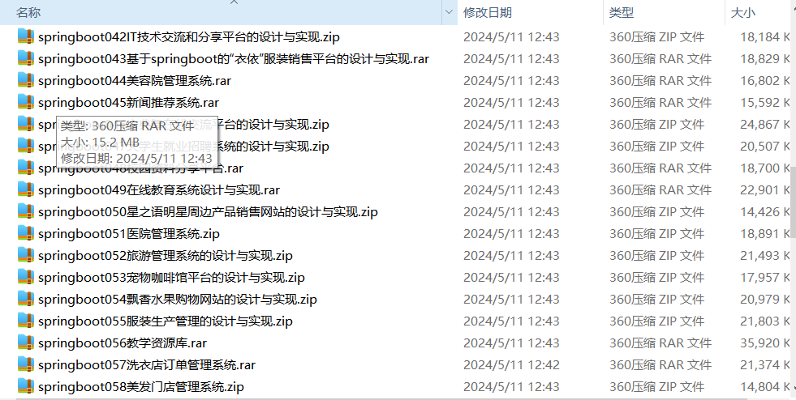

# springboot_book_mall_mental_nurse_auction
📦 **SpringBoot多功能项目仓库** 🎯

本仓库汇集了五个基于 **SpringBoot** 的实用项目，适用于学习、实践和功能扩展！🚀

📖 **图书个性化推荐系统** —— 结合推荐算法，智能推送你感兴趣的书籍 📚✨

🛍️ **网页时装购物系统** —— 商品展示、购物车、订单管理，一站式购物体验 👗🛒

💬 **学生心理咨询评估系统** —— 在线测评+咨询预约，关爱学生心理健康 🧠❤️

🏥 **医护人员排班系统** —— 智能排班、轮班管理，助力医疗行业高效运行 👩‍⚕️📅

⚖️ **在线拍卖系统** —— 实时竞价、交易管理，体验刺激的在线拍卖场景 🔨💰

项目部署说明✨：

推荐使用：谷歌浏览器

后台地址😎
http://localhost:8080/springboot/admin/dist/index.html

管理员  abo 密码 abo

前台地址😎

http://localhost:8080/springboot547vl/front/index.html

在src\main\resources\application.yml中编辑数据库配置🎉										
url: jdbc:mysql://127.0.0.1:3306/springboot?useUnicode=true&characterEncoding=utf-8&useJDBCCompliantTimezoneShift=true&useLegacyDatetimeCode=false&serverTimezone=UTC
username: root
password: 123456

文档预览👀

其他项目合集✨🎶

